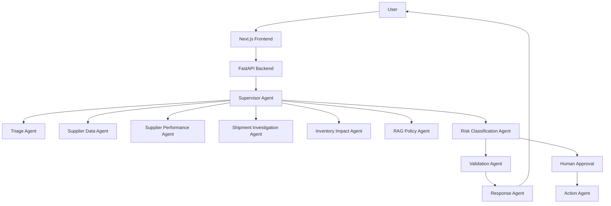
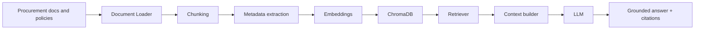
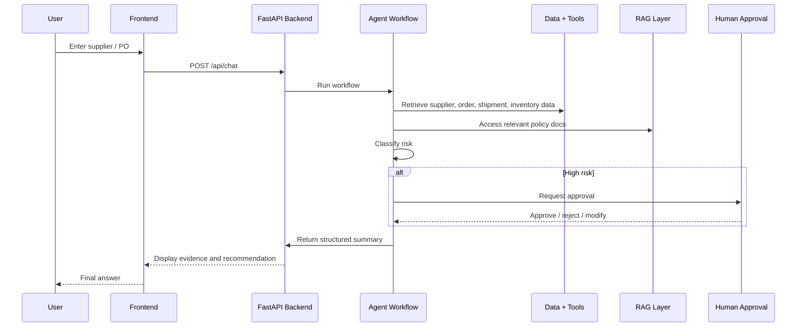

# Retail Supplier Delay Risk Classification

## Overview
This project demonstrates an agentic AI application for supplier delay risk classification in a retail procurement context. It combines specialized agents, deterministic business logic, tool calls, a retrieval-augmented knowledge layer, and a risk classification workflow with human review for consequential actions.

## Business Problem
Retail organizations depend on suppliers to deliver goods and materials on time. Supplier delays can create stockouts, lost sales, emergency shipping costs, and customer dissatisfaction. The solution analyzes supplier performance, order status, inventory impact, and procurement policy to classify the risk of delay.

## Features
- Multi-agent workflow with specialized roles
- Supplier and purchase-order analysis
- Shipment and inventory impact assessment
- RAG-based policy retrieval using ChromaDB
- Risk classification as LOW / MEDIUM / HIGH
- Guardrails for supplier-risk scope, validated identifiers, and read-only access
- Human review proposals for high-risk recommendations; no operational actions are executed
- FastAPI backend and Next.js frontend
- Structured logs and test coverage

## Architecture



## Multi-Agent Design
The workflow includes these specialized agents:
- Supervisor Agent
- Triage Agent
- Supplier Data Agent
- Supplier Performance Agent
- Shipment Investigation Agent
- Inventory Impact Agent
- RAG / Policy Agent
- Risk Classification Agent
- Investigation Agent
- Action Agent
- Validation Agent
- Response Agent

## Technology Stack
- Frontend: Next.js + TypeScript + Tailwind CSS
- Backend: FastAPI + Pydantic + Python
- Agent orchestration: LangGraph-style workflow runner
- Vector database: ChromaDB
- LLM: configurable OpenAI integration
- Database: SQLite fallback for local demo; PostgreSQL-ready design
- Deployment: Docker + Vercel ready

## RAG Architecture



## Risk Classification Methodology
The system combines:
- Supplier historical delivery rate
- Recent delay signals
- Shipment status and delay estimates
- Inventory days-of-supply and stockout risk
- Policy evidence from the RAG layer
- Human review triggers for high-risk classifications

The demo computes a score and explicit risk class without claiming the score is a calibrated statistical probability. It distinguishes between model confidence, business risk, and evidence.

## Agent Guardrails
- Requests are limited to supplier delay risk classification and known supplier/purchase-order records. Unknown, ambiguous, or mismatched identifiers are rejected rather than replaced with demo defaults.
- The workflow only reads its local supplier, purchase-order, shipment, inventory, and policy data. External/action tools are disabled; action recommendations are proposals and never report success.
- High-risk recommendations are marked `PENDING` human review. Workflow/approval state is not persisted, so the approval endpoint returns `409` and cannot authorize execution. No operational action is run after an approval request.
- User instructions and retrieved documents are treated as untrusted data. The policy retriever uses a fixed domain query rather than arbitrary user text.
- Request/query lengths and ID formats are bounded; unsupported operational-action requests and instruction-override attempts are rejected with explicit API errors.

This demo persists pending approval requests for monitoring, but does not implement reviewer identity, approval decisions, or a downstream action executor. Approval submissions are rejected until those capabilities are implemented and secured.

## Observability
- The FastAPI backend creates `backend/observability.db` (override with `OBSERVABILITY_DB_PATH`) using SQLite WAL, foreign keys, indexes, and a five-second busy timeout.
- `/metrics`, `/logs`, `/traces`, and `/drift` are backed by `/api/observability/*`, `/api/metrics/*`, `/api/logs`, `/api/traces`, and `/api/drift` APIs. Data is paginated and time/environment filterable.
- Seeded synthetic demonstration events are inserted once into SQLite so dashboards are populated at first launch. Subsequent request, agent, tool, RAG, guardrail, approval-request, drift, error, and system measurements are recorded from real execution; no random data is generated for live requests.
- Every API request receives server-generated request, trace, and session UUIDs exposed as response headers. Trace detail correlates spans with logs, model calls, agent runs, tools, retrieval, errors, and guardrail events. Raw request text and credentials are not stored in observability events.
- SQLite queries are measured with operation, table, duration, status, and error type; SQL statements and parameter values are not stored. Database metrics include query latency percentiles and slow-query samples without exposing the absolute database path.
- The SQLite retention cleanup runs at startup and at most hourly, retaining 90 days by default. Configure `OBSERVABILITY_RETENTION_DAYS` to change the positive retention period.

### Deploying the dashboard to Vercel
- Import this repository in Vercel and set the project's **Root Directory** to `frontend`. The Next.js project configuration is in `frontend/vercel.json`.
- Configure `BACKEND_API_URL` as the origin of a publicly reachable FastAPI deployment, for example `https://api.example.com` (do not append `/api`). Vercel rewrites same-origin `/api/*` requests to that service, so the browser does not need direct cross-origin API access.
- Deploy the FastAPI backend separately on a host that supports persistent storage. Its health endpoint must respond at `https://api.example.com/api/health`. Configure its environment variables, including a persistent `OBSERVABILITY_DB_PATH` and `CORS_ORIGINS` if other browser clients will access it directly.
- After deployment, the dashboard pages are `/logs`, `/metrics`, `/traces`, and `/drift`. Verify the backend through `/api/health` and check these routes on the Vercel domain.
- Do not use a Vercel deployment URL as `BACKEND_API_URL` unless that deployment also runs the FastAPI API and its persistent SQLite storage.

## Folder Structure
```text
.
├── backend/
│   ├── app/
│   │   ├── agents/
│   │   ├── api/
│   │   ├── evaluation/
│   │   ├── graph/
│   │   ├── models/
│   │   ├── prompts/
│   │   ├── rag/
│   │   ├── services/
│   │   ├── tools/
│   │   ├── config.py
│   │   └── main.py
│   ├── data/
│   ├── tests/
│   ├── requirements.txt
│   ├── Dockerfile
│   └── .env.example
├── frontend/
│   ├── app/
│   ├── package.json
│   └── Dockerfile
├── docker-compose.yml
├── README.md
├── .gitignore
└── LICENSE
```

## Installation
### Backend
```bash
cd backend
python -m venv .venv
source .venv/bin/activate
pip install -r requirements.txt
cp .env.example .env
```

### Frontend
```bash
cd frontend
npm install
```

## Environment Variables
Create a backend `.env` file with values similar to:
```bash
OPENAI_API_KEY=your_key_here
OPENAI_MODEL=gpt-4o-mini
API_HOST=0.0.0.0
API_PORT=8000
CORS_ORIGINS=http://localhost:3000
OBSERVABILITY_RETENTION_DAYS=90
```

## Running Locally
### Start backend
```bash
cd backend
source .venv/bin/activate
uvicorn app.main:app --host 0.0.0.0 --port 8000 --reload
```

### Start frontend
```bash
cd frontend
npm run dev
```

### Or use Docker Compose
```bash
docker compose up --build
```

## API Endpoints
- POST /api/chat
- POST /api/agent/run
- POST /api/risk/classify
- GET /api/health
- GET /api/metrics
- GET /api/suppliers/{supplier_id}
- GET /api/purchase-orders/{purchase_order_id}
- GET /api/sessions/{session_id}
- GET /api/workflows/{workflow_id}
- POST /api/approval/{workflow_id}

## Sample Request
```bash
curl -X POST http://localhost:8000/api/chat \
  -H "Content-Type: application/json" \
  -d '{
    "user_query": "What is the delay risk for supplier SUP001 and purchase order PO10025?",
    "supplier_id": "SUP001",
    "purchase_order_id": "PO10025",
    "product_id": "PROD100"
  }'
```

## Testing
```bash
cd backend
pytest
```

## Evaluation
The project includes a sample evaluation dataset in `backend/app/evaluation/sample_cases.py` with normal, medium, high-risk, and adversarial scenarios. Those datasets can be expanded to measure:
- intent classification accuracy
- risk classification accuracy
- retrieval relevance
- citation correctness
- policy compliance
- escalation correctness

## Deployment
### Vercel
The frontend is ready for Vercel deployment using the `NEXT_PUBLIC_API_URL` environment variable.

### Docker / Backend
The backend is containerized and can be deployed to Azure, AWS, Render, or Railway using the included Dockerfile and `docker-compose.yml`.

## Limitations
- This is a working demo that uses realistic synthetic data.
- The LLM path is configurable and falls back to deterministic logic when an API key is not available.
- The vector store is functional for local demo use and can be expanded for production-grade policy ingestion.

## Future Enhancements
- Add persistent PostgreSQL storage and analytics tables
- Expand the human approval workflow with an approval dashboard
- Implement richer retrieval and reranking
- Add LangSmith or OpenTelemetry tracing
- Add a dedicated ML risk-scoring model service alongside the rules-based system

## Architecture Diagram


